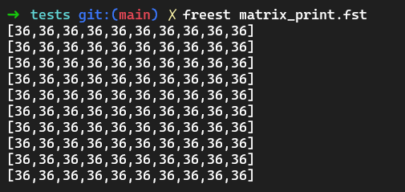
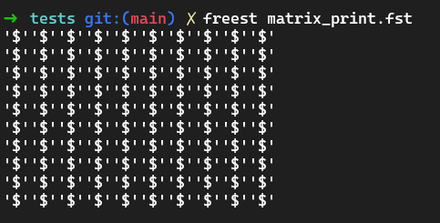

# FreestUtils

Was a bit bored and decided to try to program in FreeST https://freest-lang.github.io/

Implemented some usefull functionality in utils.fst:
- Matrices
- More List functionalities
- Interesting Printing Funcitonalities

# Matrices

Matrices are defined as an 1d list with x*y elements, with x being the width of the matrix.

Matrices can be created using:

```Haskell
-- Zero filled matrix
mInit x y
```

```Haskell
-- Value filled matrix
mInitFill x y value
```

These functions return a Matrix type, with x*y elements.

Aditionally, we can read and write to a matrix using:

```Haskell
-- Returns the Integer at position (x, y) in the matrix
mRead matrix (x, y)
```
```Haskell
-- Writes valuet to position (x, y) in the matrix
mWrite matrix (x, y) value
```

Finally we can print the matrix

```Haskell
-- Prints all the integers in the matrix
mPrint matrix
```

E.g:
```Haskell
main : String
main = 
    mPrint (mInitFill 10 10 36) ; 
    "\0" -- avoid printing () to the terminal
```

Output:



One can also print the entire matrix as if it was a buffer of chars

```Haskell
main : String
main = 
    bufferPrint (mInitFill 10 10 36) ; 
    "\0" -- avoid priting () to the terminal
```

Output:




# Donut

Tried to implement a spinning donut using the algorithm in https://www.a1k0n.net/2011/07/20/donut-math.html, but the code runs to slow. 

The lack of functionality involving floats made it challenging to implement it.
